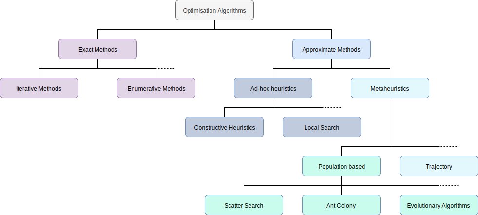
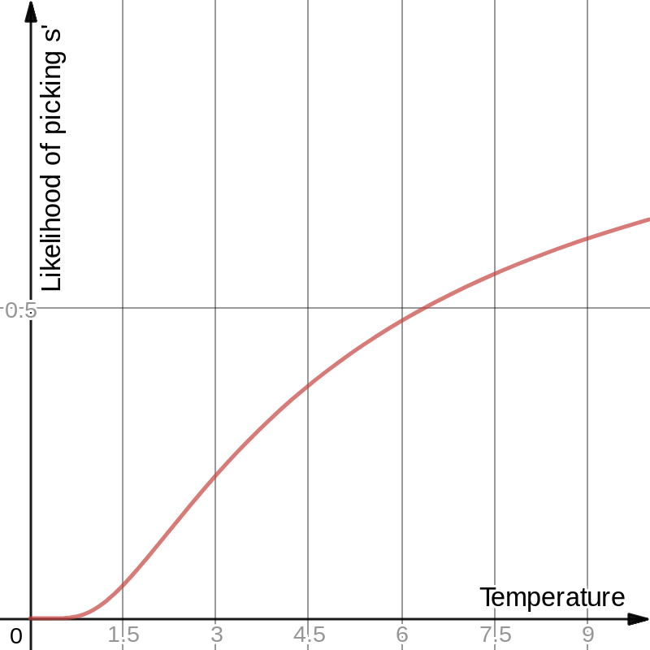

# Artificial Intelligence

## Table of Contents
* [Artificial Intelligence](#artificial-intelligence)
  * [What is Artificial Intelligence?](#what-is-artificial-intelligence)
    * [Rational Agent](#rational-agent)
  * [Search](#search)
    * [Optimisation problems](#optimisation-problems)
      * [Heuristic Optimisation](#heuristic-optimisation)
        * [NP-Hardness](#np-hardness)
        * [Constructive Heuristics](#constructive-heuristics)
        * [Local Search Heuristics](#local-search-heuristics)
    * [Tree Search](#tree-search)
      * [Comparing Strategies](#comparing-strategies)
      * [Uninformed Search Strategies](#uninformed-search-strategies)
        * [Breadth-first algorithms](#breadth-first-algorithms)
        * [Depth-first algorithms](#depth-first-algorithms)
      * [Informed Search](#informed-search)
        * [Best-first Search](#best-first-search)
          * [Greedy search](#greedy-search)
          * [A*](#a)
    * [Local Search](#local-search)
      * [Hill Climbing Search Algorithm](#hill-climbing-search-algorithm)
      * [Metaheuristics](#metaheuristics)
        * [Multiple restarts hill climbing](#multiple-restarts-hill-climbing)
        * [Iterated Local Search](#iterated-local-search)
        * [Simulated Annealing](#simulated-annealing)
        * [Tabu Search](#tabu-search)
    * [Population-based Algorithms](#population-based-algorithms)
      * [Evolutionary Algorithm](#evolutionary-algorithm)
      * [Memetic Algorithms](#memetic-algorithms)
      * [Other evolutionary algorithms](#other-evolutionary-algorithms)
      * [Other population-based algorithms](#other-population-based-algorithms)
  * [Machine Learning](#machine-learning)
  * [Advanced Applications](#advanced-applications)
    * [Natural Language Processing](#natural-language-processing)
    * [Robotics](#robotics)
  * [Conclusions](#conclusions)

## What is Artificial Intelligence?

There are four historical definitions of artificial intelligence:

- **Thinking Humanly**
     - Studying how humans think
     - Emulating the functioning of human mind
- **Acting Humanly**
     - Having a machine that seem to think like a human mind
     - Turing test
  - **Thinking Rationally**
    - Notation and rules of logical thought
  - **Acting Rationally**
    - Having an **agent** that achieves the best outcome

The last definition is the one that is one that is currently recognised.

A **problem** has a **goal** and a set of allowed **actions** to achieve it
A **solution** is a sequence of allowed actions that achieves a problem's goal.

### Rational Agent
A **rational agent** is something that, for a specific problem, **acts rationally**, i.e. does the action that **maximise goal achievement**. This does not necessarily include rational thinking.

## Search

Search in computer science can be intended as follow:

1. Search for stored data
2. Search for web documents
3. Search for path or routes
4. Search for solutions

### Optimisation problems
In mathematics and computer science an **optimisation problem** is the problem of finding the **best solution** from all feasible solutions. The best solution is defined by the minimisation of time, cost and risk and/or the maximisation of profit, quality and efficiency.

Optimisation problems can be, depending on their variables, **continuous** and **discrete**.



#### Heuristic Optimisation
A heuristic is a technique designed for solving a problem quickly (**rule of thumb**), using problem-specific knowledge, where the traditional approach would be too slow, or wouldn't find a complete solution.

Problems known as **NP-hard** are usually better tackled with heuristics.

##### NP-Hardness
The NP-hardness (non-deterministic polynomial time hardness) is a property of an optimisation problem. A problem is categorised as NP-hard where there is no algorithm that is capable of solving it in polynomial time (`O(n^k)`) on a _non-deterministic Turing machine_.


- `P` ─ set of problems that can be solved in polynomial time by a Turing machine
- `NP` ─ set of problems that can be solved in polynomial time by a nondeterministic Turing machine
- `NP-hard` ─ set of problems that are at least as hard as the hardest problem in NP 

```
____________________________________________________________
| Problem Type | Verifiable in P time | Solvable in P time | Increasing Difficulty
___________________________________________________________|           |
| P            |        Yes           |        Yes         |           |
| NP           |        Yes           |     Yes or No *    |           |
| NP-Complete  |        Yes           |      Unknown       |           |
| NP-Hard      |     Yes or No **     |      Unknown ***   |           |
____________________________________________________________           V
```
\* An NP problem that is also P is solvable in P time.

** An NP-Hard problem that is also NP-Complete is verifiable in P time.

*** NP-Complete problems (all of which form a subset of NP-hard) might be. The rest of NP hard is not.


##### Constructive Heuristics
A **constructive heuristic** is an algorithm that starts with an empty solution, and extends the current solution until a complete solution is found.

##### Local Search Heuristics
A **local search** algorithm starts from a complete solution, and tries to improve the current solution by via  local changes.

### Tree Search
A search problem can be mapped as as a tree of **state spaces** joined by actions. The tree root is the initial state. This allows the traversal of the tree using a search algorithm, that finds a solution to the problem. Hence, a **solution** is a sequence of actions (a plan) that reaches the **goal state**.

A **state space** contains:
- **The world state** ─ set of every detail of the problem
- **Search state** ─ set of details needed for planning

A search problem can be formulated as follows:
- (states)(???)
- Initial state
- Actions
- Transition Model
- Goal test
- Path cost

An example of this is the shortest path problem between two nodes in a weighted graph.

[Good article here](http://how2examples.com/artificial-intelligence/tree-search)

#### Comparing Strategies
Search algorithm can be compared based on the followings:
- completeness: does it always find a solution if one exists?
- time complexity: number of nodes generated
- space complexity: maximum number of nodes in memory
- optimality: does it always find a least-cost solution?

#### Uninformed Search Strategies
**Uniformed search strategies** also called **blind search strategies** use only the information available in the problem definition.

Uniformed search algorithms can be either breadth-first or depth-first.

##### Breadth-first algorithms
Aims to expand the shallowest unexpanded node.


- Complete: Yes (if b is finite)
- Time:  O(b^(d+1))
- Space: O(b^(d+1)) (keeps every node in memory)
- Optimal: Yes (ONLY if cost = 1 per step)

##### Depth-first algorithms
Aims to expand the deepest unexpanded node.


- Complete:
    - YES in finite spaces
    - NO in infinite-depth spaces, loops
        - Can be modified to avoid repeated states along path
- Time:  O(b^m)
- Space: O(b·m) (linear space!)
- Optimal: No

It is possible to impose a maximum depth (**depth-limited search**) to the algorithm. This would make the algorithm **complete**, but still **not optimal**.

Also, it is possible to gradually increase the maximum depth, combining the benefits of DFS and BFS.

#### Informed Search
Informed search algorithms use a problem-specific **evaluation function** that describes the desirability of a given search state.

##### Best-first Search
Best-first search algorithms expand the mode desirable node first.

###### Greedy search
Expands the node closest to the goal.


- Complete: No
- Time:  O(b ^ d )
- Space: O(b ^ d )
- Optimal: No

###### A*
Expands the node on the least-cost solution path.


The evaluation function (`f(n)`) takes in account of:
- `g(n)`: path cost from the start node to node _n_.
- `h(n)`: the cost to get from the node to the goal.

`f(n)` = `g(n) + h(n)`

So it makes sense to expand the node with lowest `f(n)`.

- Complete: Yes
- Time:  O(b ^ d )
- Space: O(b ^ d )
- Optimal: Yes (ONLY if cost = 1 per step)

### Local Search
Local search algorithms are based on the concept of **neighbourhood**. A neighbour is a search space that is _near_ to another, according to a **move operator**, i.e. bit-flip mutation.

#### Hill Climbing Search Algorithm
The hill-climbing search is a local search algorithm, that starting with a complete random solution, keeps moving towards _better_ neighbours until it cannot find a better one. The algorithm is only able to find local optima, which might or might not be the global optimum. On shoulders, it will just make random walks. Such algorithm is **not deterministic**, rather it depends on the random start.


- Complete: No
- Time:  O(∞) (Worst case scenario it could go forever!)
- Space: O(b)
- Optimal: No

There are a few variants of this algorithm, such as the **Stochastic Hill Climb** (choose a random neighbour, and move if it's a better solution).

#### Metaheuristics
Metaheuristics are meta-algorithms that attempt to select the best algorithm for a given approach. In the field of local searches, they are particularly useful in escaping the local optima, and balancing the **exploration** and **exploitation** features of an algorithm. 

Key components of metaheuristics:
- Problem representation
- Fitness function
- Search/variations operators
- Initial solution(s)
- Search strategy

A list of successful local search metaheuristics will now follow.

##### Multiple restarts hill climbing
**Multiple restarts hill climbing** is a meta-algorithm that runs many instances of the hill-climbing algorithm, and picks the closer to the goal state, increasing the chances of finding the global maximum.

Pseudocode:
```
procedure Multiple restart hill-climbing
begin
    s = randomly generated solution
    best = s
    repeat
        s = hill_climbing(s)
        if evaluation(s) is better than evaluation(best)
        	best = s
        	s = randomly generated solution
    until stopping-criteria satisfied
    return best
end
```

##### Iterated Local Search
This meta-algorithm is a simple way of improving the hill climbing. Once a random solution is found, it performs a random permutation, and applies the hill climbing again. If the solution is deemed better, is stored. This keeps going until a stopping criterion is reached, such as the number of iterations, or a certain value is reached.

Pseudocode:
```
procedure Iterated local search
begin
    s = randomly generated solution
    s = hill-climbing(s)
    best = s
    repeat
        s = perturb(s)
        s = hill-climbing(s)
        if evaluation(s) is better than evaluation(best)
        	best = s
    until stopping-criteria satisfied
    return best
end
```

##### Simulated Annealing
Allows the algorithm to proceed towards worse solutions to favour **exploration** over **exploitation**.
Usually the algorithm works like this: at each time step, the algorithm randomly selects a solution close to the current one, measures its quality, and then decides to move to it or to stay with the current solution based on either one of two probabilities between which it chooses on the basis of the fact that the new solution is better or worse than the current one. During the search, the temperature is progressively decreased from an initial positive value to zero and affects the two probabilities: at each step, the probability of moving to a better new solution is either kept to 1 or is changed towards a positive value; instead, the probability of moving to a worse new solution is progressively changed towards zero.
In other words, while the state is _hot_ the algorithm is more likely to explore, while the more cool it gets, it becomes more likely select only a good solution, until it converges to a standard hill climbing at `temperature = 0`;


```
procedure simulated annealing
begin
    s = random solution
    repeat for k = 0 through max_iterations
      	T = temperature (k/max_iterations)
        new_s = random neighbour 
        if accept(evaluate(s), evaluate(new_s), T) > random(0,1)
        	s = new_s
    return s
end

procedure temperature (fraction)
begin
	return a temperature based on the fraction
end

procedure accept (s, new_s, T)
begin
	if new_s better than s
    	return 1
    else
    	return exp(-(new_s - s) / T)
end
```

This graph shows the results of an acceptance function given an `new_s` worse than `s`.
The higher the temperature, the more likely the algorithm is to pick up a solution that to favour exploration of the space.



##### Tabu Search
**Tabu search** enhances the performance of **local search** by relaxing its basic rule. First, at each step worsening moves can be accepted if no improving move is available (like when stuck at a local optimum). In addition, **prohibitions** (_tabu_) are introduced to discourage the search from coming back to previously-visited solutions.


Pseudocode:
```
procedure taboo search 
begin
    sBest = s0
    bestCandidate = s0
    tabuList = []
    tabuList.push(s0)
    loop 
        sNeighborhood = getNeighbors(bestCandidate)
        
        for (sCandidate in sNeighborhood)
            if ( (not tabuList.contains(sCandidate)) and (fitness(sCandidate) > fitness(bestCandidate)) )
                bestCandidate = sCandidate
            end
        end
        
        if (fitness(bestCandidate) > fitness(sBest))
            sBest = bestCandidate
        end
        
        tabuList.push(bestCandidate)
        
        if (tabuList.size > maxTabuSize)
            tabuList.removeFirst()
        end
    until stopping-criteria satisfied
    return sBest
end
```

### Population-based Algorithms
While ad-hoc heuristics attempt to maximise the **exploitation** of the search space, **population-based algorithms** aim to maximise **exploration**.

They generate a large amount of solutions and evaluate which one is the best.

#### Evolutionary Algorithm
Evolutionary algorithms are based on the process of **natural selection**. At the beginning they generate a great amount of diverse, solutions. They then get selected and permuted in order to find the best solution.

Pseudo code of a generic evolutionary algorithm:
```
procedure evolutionary
begin
	p(0) = random population
   t = 0
   loop for t
    	evaluate  p(t)
        P' (t) = select(p(t)) # select parents
        P'' (t) = variation(p'(t)) # apply variations
        P(t+1) = replace(p(t), p''(t)) # replace population
        t++
    until stopping-criterion satisfied
return best solution in p
```

#### Memetic Algorithms
**Memetic algorithms** are a combination of _genetic algorithms_ and local search operators. They are inspired from both the concept of Darwinian evolution and Dawkins' notion of _meme_. For this reason they are also called _Lamarckian_ or _Baldwinian_. They were found to be empirically faster than standard genetic algorithms, as they use problem-specific heuristics to make the evolutionary process more efficient.

Pseudocode for a generic Memetic Algorithm:
```
Procedure Memetic Algorithm
   Initialize: Generate an initial population;
   while Stopping conditions are not satisfied do
       Evaluate all individuals in the population.
       Evolve a new population using stochastic search operators.
       Select the subset of individuals, O{il}, that should undergo the individual improvement procedure.
       for each individual in O{il} do
           Perform individual learning using meme(s) with frequency or probability of f(il), for a period of t(il).
           Proceed with Lamarckian or Baldwinian learning.
       end for
   end while
   ```
#### Other evolutionary algorithms
- Evolution Strategies
- Genetic Programming

#### Other population-based algorithms
- Ant colony optimisation
- Particle swarm optimisation

## Machine Learning
Machine learning (ML) is the study of algorithms and mathematical models that computer systems use to progressively improve their performance on a specific task. 
In other words, is the science of getting computer act without being explicitly programmed.

Advantages:
- No need to anticipate all possible situations
- No need to manually update the design over time 
- No need to manually design a specific algorithm

Machine learning algorithms are classified in three main classes, according to their **task**:
- **Classification**
    - Identify to which category an object belongs to.
- **Regression** 
    - Predict a numerical value associated to an object.
- **Clustering**
    - Automatically organised similar objects into groups.

There are also three type of learning, based on the **feedback**.
- **Supervised learning**
    - The learning data is presented with some input-output examples
    - Useful for _classification_ and _regression_.
- **Unsupervised learning**
    - The learning data only contains inputs.
    - Useful for _clustering_.
- **Reinforcement learning**
    - The algorithm learns from environmental feedbacks, such as punishments and rewards.
    - Useful for _game playing_.

### Decision Trees
**Decision trees** are one of the simplest and most effective forms of machine learning techniques.


They are particularly useful with discrete input values and binary a classification as an output.

Decision trees are **rule-based models**, hence, during the training phase, they aim to discover a rule from the data, and produce a set of branching decisions that end in a classification.

The model tries to optimise the tree by arranging the decision in the most effective way (minimise the number of decision nodes). This is achieved by greedily using the decisions that reduce the information entropy the most.

When the model is applied, the tree is traversed until a conclusion (_leaf_) is found.

## Advanced Applications

### Natural Language Processing

### Robotics

## Conclusions
