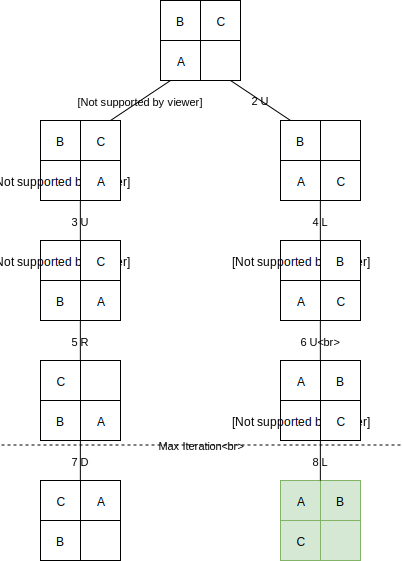
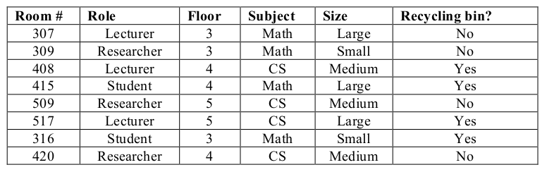

2015 Exam
=========

Question 1
---------------

> (a) In the context of Artificial Intelligence, briefly describe:

> What is an agent?

In the context of artificial intelligence, an **agent** is any entity capable of perceiving through **sensors** and acting upon the environment through **actuators**. §2.1 Humans, robots, programs are all agents.

> What is an uninformed search strategy? Mention two algorithms  use this strategy.

An **uninformed search strategy** is a set of search algorithms that are given no information about the problem other than its definition. They are also known as **blind**. They can only generates new states and distinguish goal-states from non-goal-states. Two know uninformed tree search algorithms are depth-first and breadth-first algorithms. They both work by exploring the entire tree, until they find a goal state. §3.4

> (b) Consider an autonomous robot designed for planetary exploration: the Mars rover:

> Describe its design in terms of the four main components of intelligent agents.

The four main components of the design of an intelligent agents (task environment) are **Performance**, **Actuators**, **Environment**, and **Sensors** §2.3. I should mention I played too much _Kerbal Space Program_.
- Performance
    - Danger level
    - Novelty
    - Maximise sites explored
    - Maximise samples analysed
    - Maximise photographs sent
- Actuators
    - Motors
    - Retractable solar panels
    - Arm
    - Drill
    - Retractable Antenna
- Environment
    - Lander
    - Rover
    - Mars!
    - Mission Control
- Sensors
    - Cameras
    - Environmental
    - On-board science kit
    - Odometers
    - Accelerometer/Gyroscopes
    - Antennas

>    Describe its environment in terms of two main distinctions or classifications of environments.

The environment is (two of these are enough) §2.3.2:
1. **Partially-Observable** — The rover can't see the whole planet
2. **Single-Agent** — Even if there are more rovers, their encounter is very unlikely, so it can be considered single-agent. Unless there are Martians.
3. **Stochastic** — It is impossible to predict the next state
4. **Sequential** — The rover will build knowledge for each step
5. **Dynamic** — The world might change (sandstorm, day/night)
6. **Continuous** – The rover is moving in the real world, not a grid
7. **Known** – The laws of physics are known (at least to the designer, hopefully)

> (c) In the 3-puzzle problem, the board is 2x2 and there are three tiles,
numbered A, B, and C, and one blank. The objective of the game is to
produce a configuration where the tiles are in consecutive order, with the
blank tile in the bottom right. The Start and End states are given below.

> Formulate the problem as a search problem indicating the required
components. Hint: consider that the actions are to move the white
space Right, Left, Up, Down. Of course not all actions are possible
from all states.

1. Initial State
    - In([BCA_])
2. Actions
    - Move blank Right, Left, Up, Down (According to constraints)
3. Transition Model
    - Moving a blank to a direction will swap the blank tile with the adjacent
4. Goal test
    - In([ABC_]) 
5. Path cost
    - The cost is one movement per state
6. States
    - The states are all the possible combinations of the tiles 

> Draw the search tree that would result from expanding 6 nodes
(including the start) of the state-space using a Depth-First-Search
approach that avoids revisiting states. The actions should be
considered in the order (R, L, U, D). As nodes of the tree, draw the
state as the 2x2 board with the specific configuration. Label the
edges with the action executed. Also enumerate each node with
consecutive numbers indicating the sequence of expansion.

Note that if the if the algorithm wasn't excluding duplicates, it would branch twice at each node. I added other two steps, that were enough to find a solution.

Question 2
-----------------
> (a) In the context of local search and evolutionary algorithms, briefly describe:

> What is a search space? Give an example of a search space.

The search space is the set or domain where a search algorithm will search for solutions. They can be either finite or infinite.

The diagram used above is a subset of the search space.

Another examples could be:
- A string, when searching for a character
- All possible moves a chess piece can do

> What is a neighbourhood? Give an example of a neighbourhood.

A neighbourhood is the set of states that are _nearby_ the current state, according to a given distance function. 

Taking the diagram above as an example, the neighbourhood of the initial node, are the first two nodes to be expanded, so all the nodes that are _one action_ away.

Other examples could be:
- The Hamming distance for strings
- Swap or insert for permutations (remember the rucksack?)

> (b) As the logistics manager in a supermarket, you need to coordinate the
home delivery of shopping baskets to 10 clients. Consider that you have
a single van and the 10 shopping baskets fit in it. You have the
addresses of the 10 clients. Your job is to deliver all the orders and
return to your base. Formulate this as an optimisation problem
indicating:

> How will you encode a solution to the problem and how will this be interpreted?

(This problem is suspiciously similar to the Travelling Salesman's, masked like the Vehicle Routing's.)
I would encode the solution of the problem as an array of addresses or coordinates. This will be read by the driver, so that the first address in the list will be served first, thus indicating the order in which each location should be reached.

> What will be the fitness function and how will you implement it?

The fitness function will be the total distance that the van has to travel to reach all the locations and then travel back to the supermarket.

> (c) Consider the data below for training a cleaning robot. The robot needs
to decide to which rooms to go for collecting recycled paper. Assume
that an indication of the information gain of each attribute is given by:
Role = 0.66, Floor = 0.06, Subject = 0.0, Size = 0.06

> Construct the smallest possible decision tree (in terms of the
number of attributes required) to solve this classification task given
the information you have. Label the non-terminal nodes with the
attributes, and the edges with attribute values. For each terminal
node (leaf) of the tree indicate the examples classified.

> Is this the only tree you can construct of this size? Justify your
answer.

No, other trees could be built, changing the second attribute (floor) with either subject or size. But this will require additional nodes before the goal state is reached.

2008 Exam
=========
This is a fairly old exam I found, some of the contents might not be in the course any more.

Question 1
---------------

> Imagine you are in an area of New York with a grid road system. Every
intersection has three choices: left, right, straight on (you never turn back). You
are looking for the Empire State Building, which you know is just two blocks
from where you are, but you don’t know which direction it is in.

> Represent your current location as a single node at the root of a tree and
then add the next two levels of the search tree to your diagram, labelling
the arcs but not the nodes. Then pick one node and label it as the goal.

> You choose to make a depth first search of the area until you find the
building. Refer to your diagram and say how many arcs of the tree you
need to traverse before you reach your goal.

A depth-first algorithm would first visit N, N-N, N-E, N-W, E, E-N, E-E, and finally the E-S node, which is the goal. This takes 8 iterations of the algorithm to find the solution.

> Now repeat the process from the part above, but use a breadth first
search this time.

A breadth-first algorithm would first visit N, E, S, W, then, N-N, NE, N-W, E-N, E-E, and finally E-S, for a total of 10 iterations.

> In general, with longer search paths, which of the two methods listed
above would be most memory efficient? There is a potential problem in
using depth first search – what is it and what other method could be used
to avoid it? Why does the other method avoid the problem?

Depth-first search is more memory efficient, because the space complexity is function of the depth only (`O(d)`). Breadth-first algorithms space complexity scales exponentially (`O(b^(d+1))`).

Depth-first algorithms can continue to expand forever when facing a recursive or infinitely deep three. As a matter of fact, their worst case time complexity is `O(∞)`.  Breadth-first algorithms are not vulnerable to this because they prioritise exploring the tree horizontally and hence are guaranteed to find a solution, as they won't proceed in an infinite deep pitfall.

> Suggest one improvement to the search algorithm that could be made to
reduce the number of nodes in the tree.

To reduce the number of nodes in the tree one could have a list of visited nodes, so that movements that bring to the same place (e.g. N-W, W-N) are not added to the tree.

> Imagine you wanted to try to use a genetic algorithm (GA) to search for
the fastest route to New York landmarks instead of using a search tree.
Describe the concepts behind how a GA works and explain how it might
be used in this case. What extra information would you need during your
search to allow a GA to work?

Genetic algorithms are population-based algorithms that work by generation and selection of solution. They are inspired from Darwinian natural selection.

They start from a population of random solutions, the fittest are selected, bred, and a the same process is repeated on the newer generation, until a certain criterion is reached.

In this case, a set of various random solutions indicating the order in which to visit the sights will be generated, and the GA will try to find the shortest path between all of them. A threshold distance, or a set number of generation can be used as stopping criterion.

In order to allow the GA to work, a function to evaluate the fitness of the solution must be implemented. In order to this, either the distance or the time to travel between each sight is required. Either a table with all the distances, or the exact locations (on the grid) of each building, and the distance might be computed using the Manhattan (!) distance function.

Question 2
---------------
This question ask about inference and other topics that are probably not covered.

Question 3
---------------
> Define the following types of learning: supervised, unsupervised and
reinforcement learning, each in terms of the feedback required from the
environment

- **Supervised Learning**: the algorithm is provided labelled data and it is supposed to find learn to predict the outputs, given the inputs (classification, regression).
- **Unsupervised Learning**: the algorithm is provided just a set of data. This is usually done for grouping similar items together and creating taxonomies (clustering).
- **Reinforcement learning**: The algorithm is provided a positive/negative feedback for each action. Particularly used in game-theory problems.

> A neural network usually contains neurons, synapses, and an activation
function. Explain the role of each of these three ingredients.

- **Neurons** are the building block of neural networks. Each node receives inputs and output synapses. The input values is given to the activation function, and the result is propagated to the outputs.
- **Synapses** are the links between neurons. They have a weight, that is adjusted during the learning process. This allows to tweak the value of the outputs given the inputs.
- **Activation functions** are non-linear function that trigger the output of the neuron, given the inputs. They usually have a sigmoid shape (logistic function).

> The Hebb rule is a simple associative network learning rule. Explain
how it works between two neurons.

"When an axon of cell A is near enough to excite a cell B and repeatedly or
persistently takes part in firing it, some growth process or metabolic change
takes place on one or both cells such that A’s efficiency as one of the cells
firing B, is increased."

OR IN ENGLISH:

"If two neurons on either side of a synapse (connection) are activated
simultaneously (i.e. synchronously), then the strength of that synapse is
selectively increased."

-------------------------------------------------------

> Imagine we want to teach a neural network to detect fraudulent
insurance claims. We have chosen a multi-layer perceptron (MLP) for
the job:

> We need to collect data representing the input and the output of
the MLP. Suggest an example input variable (use your
imagination) and say what the output would be.

Possible input variables could be:
- Age of the claimer
- Number of claims made in the past
- Amount
- Type of incident

While the output could either be:
- Fraudulent/legitimate hard threshold
- Or a percentage of the likeliness of the claim being fraudulent 

> Name the three different types of neuron found in a MLP.

According to where they are placed, neurons can be part of the **input layer**, **hidden layer**, or **output layer**.

> What do we mean by the ‘error’ made by a MLP during training?

I have no flying clue.

> To what use is the error put during training?

I suppose to fix the the weights during back propagation? Well, I don't care, this ain't gonna be in the exams anyway.

> What do we mean when we say that MLPs can suffer from over
training, and what can we do to avoid this problem?

Over training, or **overfitting** is when a machine learning becomes extremely good at predicting the values in the dataset provided, although that doesn't reflect the real world. To do that, the dataset is split between training and testing, thus giving more precise accuracy scores.